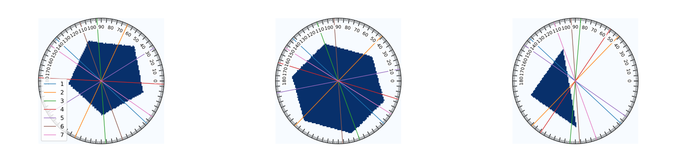
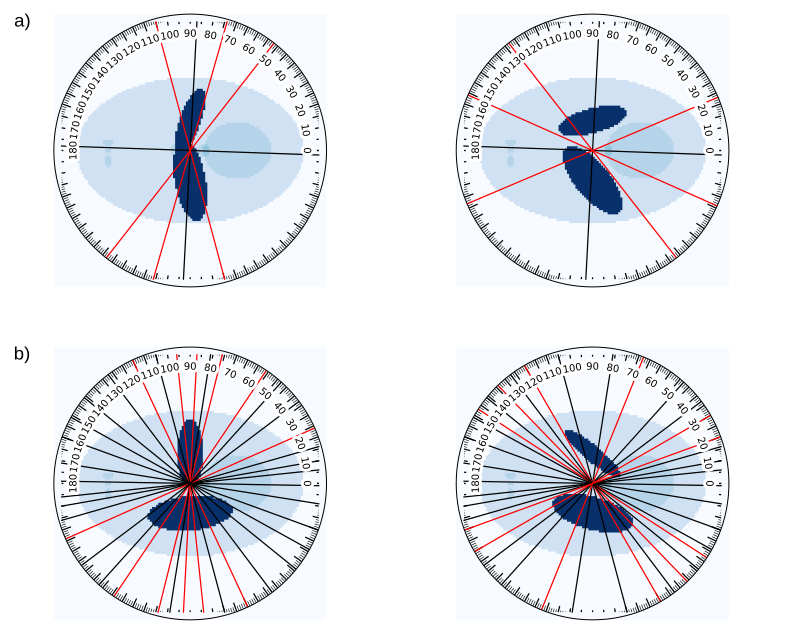

# SeqAngleRL

This repository contains the code for the Sequential Experimental Design for X-ray CT using Deep Reinforcement Learning (SeqAngleRL) project. The work was published on [IEEE Transactions on Computational Imaging](https://ieeexplore.ieee.org/document/10572344/authors#authors). A PDF version is available [here](https://ir.cwi.nl/pub/34320/34320.pdf).

## Project Overview
SeqAngleRL develops a framework for sequential experimental design in X-ray CT using deep reinforcement learning. The objective is to optimize projection‐angle selection during imaging, improving reconstruction quality while minimizing acquisition time. We validate the learned policies through numerical experiments on a range of synthetic phantoms—from simple shapes to more complex structures—focusing on parallel‐beam geometry in 2D tomography.

## Selected Results

  
*Figure 1: Sample results illustrating the personalized strategies learned by the Actor-Critic policy for mixed phantoms under the end-to-end reward setting. The first two selected angles are fixed to 137° and 46° for the hexagon and triangle, respectively, while for the pentagon, they are 137° and 65°. Color encodes the selection order.*

  

*Figure 2: Illustration of personalized strategies learned by the Actor-Critic policy for modified Shepp-Logan phantoms under the end-to-end reward setting. Two groups are shown based on angle counts: a) five angles; b) nineteen angles. The first two rows present distinct phantom instances. Red lines highlight the agent’s a-posteriori adaptation to ellipse rotations.*

## Repository Structure
- **PhantomGenerator.py**  
  Generates all 2D synthetic phantoms used in our experiments, including circles, ellipses, triangles, mixed shapes, modified Shepp–Logan phantoms, and a modified Shepp–Logan with a fixed ellipse.

- **Environment_RL.py**  
  Implements the RL environment under both incremental and end‐to‐end reward settings. This file includes forward‐projection, SIRT‐based reconstruction, sequential angle selection, and reward computation, enabling the agent to interact with the simulated CT acquisition.

- **Actor-Critic.py**  
  Contains the encoder network and the training loop. The main function computes policy gradients and updates both actor and critic networks according to the actor–critic algorithm.

